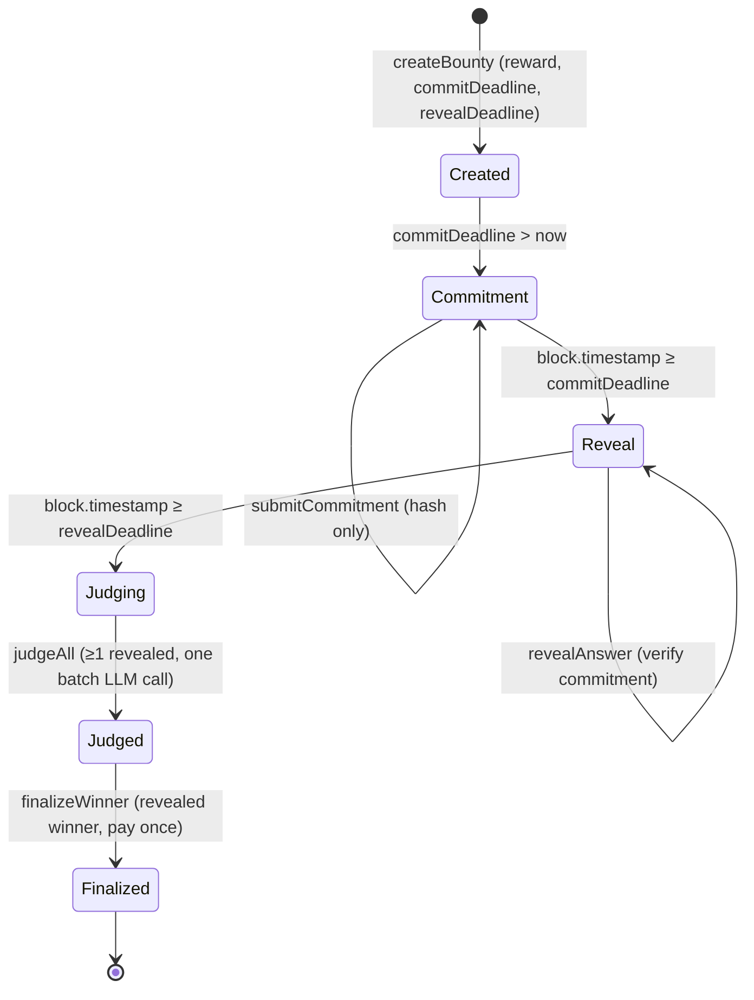
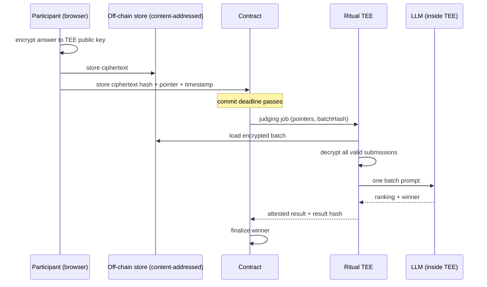

# Architecture

## Components

### On-chain (`hardhat/contracts/AIJudge.sol`)

- **Bounty registry.** `mapping(uint256 => Bounty)` with an incrementing
  `nextBountyId`. Each bounty holds owner, title, rubric, reward,
  `commitDeadline`, `revealDeadline`, `judged`, `finalized`, `aiReview`,
  `batchHash`, `winnerIndex`, and a `Submission[]`.
- **Submission model.**
  ```solidity
  struct Submission { address submitter; bytes32 commitment; string answer; bool revealed; }
  ```
  The `answer` field is the empty string until a successful reveal.
- **O(1) participant lookup.** `mapping(uint256 => mapping(address => uint256)) submissionIndexPlusOne`
  stores `index + 1` so a participant's submission is found without looping
  (`0` means "no submission").
- **LLM precompile bridge.** `PrecompileConsumer._executePrecompile(LLM_INFERENCE_PRECOMPILE, llmInput)`
  calls `0x0802` and decodes the short-async return shape.
- **Guards.** `bountyExists`, `onlyOwner`, a `nonReentrant` mutex, custom errors,
  and checks-effects-interactions on payout.

### Off-chain (`web/`)

- **Next.js + wagmi + viem** UI for the full lifecycle.
- **`lib/commitReveal.ts`** — salt generation (`crypto.getRandomValues`),
  commitment computation (matching `abi.encode`), and local reveal-secret
  storage.
- **`lib/ritualLlm.ts`** — builds the batch judging prompt and encodes the
  single `llmInput` payload for `judgeAll`.
- **`hooks/useRevealSecret.ts`** — reads the local reveal secret reactively via
  `useSyncExternalStore`.

### Ritual AI integration

`judgeAll` forwards `llmInput` to the LLM inference precompile (`0x0802`). On
Ritual Chain the block builder detects the precompile call, runs the model in a
TEE executor, and replays the transaction with the signed result. The contract
decodes `(bool hasError, bytes completionData, bytes, string errorMessage, ConvoHistory)`
and stores `completionData` as `aiReview`. The frontend parses that JSON to show
a recommended winner and per-submission notes. Judging spends prepaid+locked
RITUAL from the caller's RitualWallet (preflighted in the UI).

## Data flow

```
Browser                         Contract (Ritual Chain)            LLM precompile (TEE)
-------                         -----------------------            --------------------
answer + salt
  → commitment hash  ──submitCommitment──▶  store commitment only
(answer/salt kept local)
        ⏳ commit deadline
answer + salt        ──revealAnswer──────▶  recompute & verify,
                                            store plaintext answer
        ⏳ reveal deadline
gather REVEALED only ──judgeAll(llmInput)─▶ compute batchHash,
                                            call 0x0802  ───────────▶ decrypt? no — plaintext
                                                                       batch prompt → LLM
                                            store aiReview ◀────────── signed result
owner picks winner   ──finalizeWinner────▶  pay revealed winner once
```

## State transitions



## What is public vs hidden

| Data | Commitment phase | Reveal phase | After judging |
| --- | --- | --- | --- |
| Bounty rules, rubric, reward, deadlines | public | public | public |
| Commitment hash | public | public | public |
| Submitter address | public | public | public |
| Answer plaintext | **hidden** (off-chain only) | public once revealed | public |
| Salt | **hidden** (never on-chain) | not emitted; only used to verify | not stored |
| AI review / winner | — | — | public |

Plaintext answers and salts never appear in calldata, storage, or events during
the commitment phase. The salt is never emitted in any event.

## Trust assumptions

- **Timestamps** are trusted within validator tolerance for deadline checks.
- **keccak256** is collision-resistant — a commitment reveals nothing about the
  answer, and a different answer/salt/sender/bounty cannot reproduce it.
- **LLM precompile + TEE** behave honestly and return a signed result.
- **Bounty owner** is trusted to build a faithful `llmInput` and finalize fairly.
  This is the weakest assumption; see the threat model.

## Threat model

| Threat | Mitigation |
| --- | --- |
| Copying a competitor's answer before the deadline | Only a hash is on-chain during commitment; plaintext stays in the participant's browser |
| Replaying another wallet's commitment | `msg.sender` is bound into the commitment |
| Replaying a commitment across bounties | `bountyId` is bound into the commitment |
| Changing the answer after committing | Reveal recomputes the hash and must match exactly |
| Revealing twice / out of phase | `revealed` flag + `commitDeadline`/`revealDeadline` checks |
| Empty or oversized answers | `EmptyAnswer` / `AnswerTooLong` (≤ 2000 bytes) checks |
| Judging unrevealed entries | Only revealed submissions are gathered; `batchHash` covers revealed only |
| Unrevealed participant winning | `finalizeWinner` requires `winnerSubmission.revealed` |
| Paying twice / reentrancy | CEI, `reward = 0` before transfer, `nonReentrant` |
| Unauthorized judging/finalization | `onlyOwner(bountyId)` |
| Owner omitting/altering judged entries | **Detectable** via `batchHash`, **not prevented** on-chain (documented limitation) |

### Honest note on `batchHash`

`judgeAll` computes `keccak256(abi.encode(bountyId, indices, submitters, answers))`
over the revealed submissions and stores/emits it. Because the owner constructs
`llmInput` off-chain, the contract cannot verify that `llmInput` actually
contains those entries. `batchHash` lets an independent observer recompute the
canonical revealed batch and check whether the owner's judging input matches.
It provides **auditability, not enforcement**. We do not claim a stronger
guarantee than that.

## Design rationale

### Why `abi.encode`

`abi.encode` length-prefixes dynamic types (the `string` answer and the
`bytes32` salt), so there is no ambiguity between, e.g., `("ab","c")` and
`("a","bc")`. `abi.encodePacked` would concatenate without separators and could
allow a hash collision between different `(answer, salt)` pairs. Matching
`encodeAbiParameters` in viem guarantees the browser and the contract produce
identical preimages.

### Why `msg.sender` and `bountyId` are in the commitment

- **`msg.sender`** binds the commitment to one wallet. Without it, an attacker
  who observed a commitment hash could front-run the reveal from their own
  wallet (the contract checks `msg.sender`'s stored commitment, so the reveal
  would fail — but binding the sender also makes the commitment meaningless to
  copy and removes any cross-wallet ambiguity).
- **`bountyId`** binds the commitment to one bounty, preventing a commitment
  made for bounty A from being replayed in bounty B.

### Why unrevealed submissions are excluded

An unrevealed commitment has no verifiable plaintext — the contract only holds a
hash. Judging it is impossible, and rewarding it would let someone win without
ever proving what they submitted. Excluding them keeps judging meaningful and
prevents a hidden entry from being finalized.

### Batch judging design

All eligible answers are serialized into one structured prompt and sent in a
single LLM request. This keeps judging consistent (the model compares all
answers in one context), bounds cost to one inference, and matches the original
`judgeAll(bountyId, bytes llmInput)` interface. The frontend filters to revealed
submissions before encoding the payload.

---

# Advanced track — Ritual-native encrypted judging (design)

> The mandatory commit-reveal track above is complete and passing. This section
> is a **design** for keeping submissions hidden even *through* judging, using a
> Ritual TEE. It is intentionally not implemented so it cannot destabilize the
> required submission.

In the commit-reveal track, revealed answers become public — fine for auditable
judging, but everyone can read winning answers afterward. A Ritual-native design
can keep plaintext hidden end-to-end.

### Where plaintext is allowed to exist

Plaintext should exist **only**:

- in the participant's browser, before encryption; and
- inside an attested Ritual TEE, during batch judging.

It must **never** appear in:

- public calldata,
- contract storage,
- events,
- public IPFS data,
- ordinary server logs,
- an unsecured backend database,
- any other on-chain data.

### On-chain data (encrypted design)

Store only non-revealing metadata:

- participant address,
- ciphertext hash,
- encrypted-submission pointer (e.g. content-addressed blob id),
- submission timestamp,
- TEE job id,
- attestation / result hash,
- final ranking or winner.

### Off-chain data

- encrypted answers,
- encrypted salts (where required),
- content-addressed encrypted blobs,
- batch judging artifacts.

### TEE judging flow



Participant encrypts answer → ciphertext stored off-chain → hash + pointer stored
on-chain → Ritual TEE loads the encrypted batch → TEE decrypts all valid
submissions → one batch prompt is created → LLM judges all answers → attested
result returns on-chain → winner is finalized.

### Critical caveat

This privacy guarantee holds **only if the LLM runs inside the TEE boundary**.
If the TEE forwards plaintext answers to an ordinary external LLM API, the
answers leave the trusted enclave and privacy is broken — the external provider
(and anyone with access to its logs) sees the plaintext. A faithful
implementation must keep model inference inside the attested enclave.
